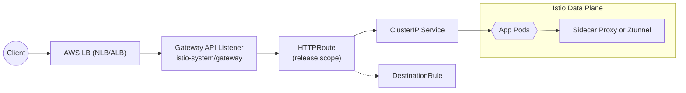

# Istio Gateway API Helm 차트 표준

이 디렉터리는 EKS 위에서 Istio(사이드카/앰비언트)와 Gateway API로 트래픽을 노출할 때 사용할 공통 Helm 차트를 보관합니다. 목표는 **애플리케이션팀은 Values만 조정**하고, **네트워킹 표준은 차트에서 보장**하도록 만드는 것입니다.

## 차트 개요

| 차트 경로 | 대상 메쉬 모드 | 기본 특징 |
|-----------|----------------|-----------|
| `istio-sidecar-with-gatewayapi/` | Istio Sidecar | `podAnnotations.sidecar.istio.io/inject: "true"`, 사이드카에 맞는 기본 프로브/라벨 |
| `istio-ambient-with-gatewayapi/` | Istio Ambient | `podLabels.istio.io/dataplane-mode: ambient`, ztunnel 친화적인 설정 |

두 차트 모두 nginx:1.27-alpine 컨테이너를 배포하고 ConfigMap으로 `index.html`을 주입합니다. HTTPRoute를 통해 Gateway API 표준에 맞게 외부로 노출됩니다.

## 네트워킹 표준

1. **GatewayClass/Gateway**
   - Istio 설치 시 `meshConfig.enableGatewayAPI=true` 필요
   - `istio-system/gateway` 리소스를 사용하며, listeners(80/http, 443/https)를 제공해야 합니다.
2. **Namespace 요구사항**
   ```bash
   kubectl label namespace <ns> shared-gateway-access=true
   ```
3. **HTTPRoute 규칙**
   - 모든 서비스는 `gatewayApi.parentRefs`로 위 Gateway를 참조
   - PathPrefix `/`를 기본으로 하되 Values에서 추가 match/filter를 정의
   - Hostname은 `*.dongdorrong.com` 패턴을 권장 (환경에 맞게 override)
4. **서비스/포트**
   - ClusterIP 서비스의 `spec.ports[0].port` 값을 HTTPRoute backendRefs가 그대로 사용

## 생성되는 리소스와 역할

| 리소스 | 템플릿 | 역할 |
|--------|--------|------|
| ServiceAccount | `templates/serviceaccount.yaml` | 애플리케이션 파드가 사용할 계정. 사이드카 모드에서 Istio 주입 대상 |
| ConfigMap | `templates/index-configmap.yaml` | `web.indexPage.content`를 담아 nginx 루트에 마운트 |
| Deployment | `templates/deployment.yaml` | nginx 컨테이너를 배포하고 사이드카/앰비언트 라벨을 주입 |
| Service | `templates/service.yaml` | ClusterIP 서비스. HTTPRoute, DestinationRule이 참조하는 가상 호스트 |
| HTTPRoute | `templates/httproute.yaml` | Gateway API 기반 L7 라우팅. host/path/filter를 Values로 제어 |
| DestinationRule | `templates/destinationrule.yaml` | mTLS 및 서브셋 정책 정의. 기본값은 `ISTIO_MUTUAL` TLS |

필요 시 AuthorizationPolicy, PolicyAttachment 등을 별도 템플릿으로 추가해 표준을 확장할 수 있습니다.

## 네트워크 흐름



클라이언트 → AWS 로드밸런서 → Istio Gateway → HTTPRoute → Service → Pod 순으로 흐르며, DestinationRule이 세부 트래픽 정책(mTLS, 서브셋 등)을 담당합니다.

## Values 구조

공통 `values.yaml`은 다음 키를 중심으로 동작합니다.

```yaml
image:
  repository: nginx
  tag: 1.27-alpine
web.indexPage.content   # 비우면 chart/릴리스/네임스페이스 정보가 출력되는 기본 HTML 사용
service.port            # 기본 80
podAnnotations/podLabels# 메쉬 모드마다 필요한 항목 정의
resources/livenessProbe/readinessProbe 등 Kubernetes 표준 값

gatewayApi:
  parentRefs:           # 기본: istio-system/gateway 의 http 리스너
  hostnames:            # 필수. ex) web.dongdorrong.com
  rules:                # matches/filters/backendRefs 구조. 기본은 PathPrefix '/'

destinationRule:
  enabled: true
  host: ""              # 비우면 서비스 FQDN을 자동 사용
  trafficPolicy:
    tls:
      mode: ISTIO_MUTUAL
  subsets: []           # 필요 시 버전/라벨 기반 서브셋 정의
```

메쉬 모드별 값은 각 차트의 기본 `values.yaml`에 포함되어 있으며, 실제 애플리케이션 특화 값은 `values-<app>.yaml` 파일을 추가해 관리합니다. 예:

```bash
helm install sample-web ./istio-sidecar-with-gatewayapi \
  -n web --create-namespace \
  -f istio-sidecar-with-gatewayapi/values-sample-web.yaml
```

## 배포 및 검증 플로우

1. Istio + Gateway API 설치 및 `gateway` 리소스가 `Accepted=True`인지 확인
2. 대상 네임스페이스에 `shared-gateway-access=true` 레이블 부여
3. Helm 차트를 배포(필요 시 여러 Values 조합으로 반복)
4. `kubectl get httproute -n <ns>`에서 `Accepted=True`, `Programmed=True` 확인
5. Istio Ingress LB 주소로 다음과 같이 호출:
   ```bash
   curl -H "Host: sample-web.dongdorrong.com" https://<lb-address>
   ```
6. 응답 HTML에 릴리스/네임스페이스 정보가 표시되면 성공

## 문제 해결 팁

- HTTPRoute `Accepted=False`: Gateway 리소스 이름/섹션, 네임스페이스 라벨을 재확인
- `503 UF`와 같은 Istio 오류: Deployment가 준비되었는지, Service/port가 일치하는지 점검
- 커스텀 HTML이 적용되지 않을 경우 `web.indexPage.content`와 ConfigMap 마운트 설정을 확인

이 문서를 기준으로 값을 추가하거나 차트를 파생시킬 때에는 위 표준을 유지하도록 합니다.
