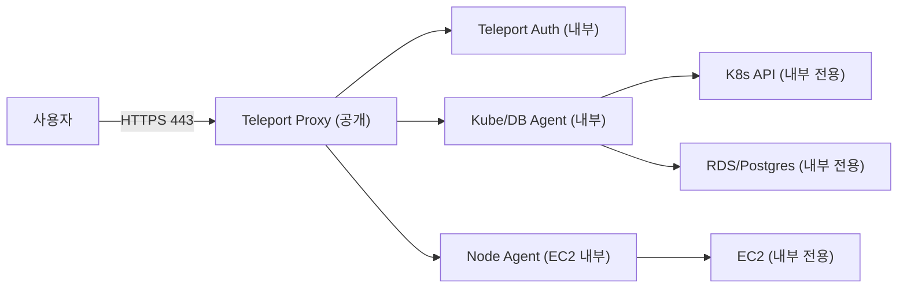

# Teleport Test (EKS + RDS + OpenTofu + SSM RunCommand)

Teleport는 SSH/Kubernetes/Database/Application 접근을 **하나의 게이트**로 통합해 관리하는 Zero Trust 접근 플랫폼입니다. 정적 키/패스워드를 공유하는 방식 대신 **단기 인증서와 정책 기반 접근**을 사용하고, **세션 감사/기록**을 기본값으로 제공합니다.

핵심 특징은 아래 네 가지로 요약됩니다.

- SSH/K8s/DB 접근을 **하나의 정책/감사 흐름**으로 통합
- **단기 인증서 발급**으로 권한 범위를 최소화
- 승인(Access Request), MFA 강제, 세션 레코딩 등 **컴플라이언스 기능 내장**
- 리소스 접근 경로를 Proxy로 집중시키는 **게이트웨이 구조**

이 문서는 Teleport의 통합 접근 제어 흐름을 체험하기 위해 EKS와 RDS를 구성하고, Teleport Cluster + Kube/DB Agent를 배포하는 실습 환경을 제공합니다.

현재 작업의 의도는 **RunCommand를 최종 운영 절차로 쓰는 것**이 아니라, `user_data`에 넣을 명령을 검증하기 위한 안전한 중간 단계로 쓰는 것입니다.

목표 흐름:

1. OpenTofu로 네트워크, EKS, RDS, 베스천, SSM 권한을 만든다.
2. RunCommand로 kubeconfig, StorageClass, Teleport Cluster, Teleport Agent 설치 명령을 단계별로 검증한다.
3. 검증된 명령만 idempotent bootstrap으로 정리해 `user_data`에 승격한다.
4. 프로젝트를 재프로비저닝했을 때 `user_data`만으로 Teleport 배포와 접근 smoke test가 끝나는지 확인한다.
5. 사람이 실제로 사용할 접근 제어는 Teleport Role, Kubernetes RBAC, RDS IAM DB Auth 정책으로 분리해 검증한다.

## 접근/네트워크 흐름 요약

Teleport는 “리소스마다 포트를 열어두는 방식” 대신 **게이트(Proxy) 하나만 외부에 노출**하고, 내부 리소스는 **직접 노출하지 않는 구조**를 지향합니다. 에이전트가 내부에서 바깥으로 터널을 열어 붙는 방식이라, 리소스 측 인바운드 포트를 최소화할 수 있습니다.



## 테스트 접근 모델

접속 테스트를 위해 장기 access key가 필요한 IAM User는 만들지 않습니다. 대신 아래 두 종류의 짧은 수명 테스트 주체를 사용합니다.

| 주체 | 위치 | 목적 |
| --- | --- | --- |
| `teleport-test-access-test-role` | AWS IAM Role | 베스천이 `sts:AssumeRole`로 잠깐 Assume해서 EKS ViewPolicy와 RDS IAM DB Auth를 직접 검증 |
| `teleport-test-user` | Teleport local user | Teleport Role을 통해 `tsh kube`와 `tsh db exec` 경로를 검증 |

접근 제어 구성:

- EKS 직접 검증: `aws_eks_access_entry.access_test` + `AmazonEKSViewPolicy`
- Kubernetes via Teleport: Teleport Role의 `kubernetes_groups=["teleport-k8s-viewer"]` + Kubernetes `ClusterRoleBinding/view`
- RDS 직접 검증: `access-test-role`에 `rds-db:connect`를 `teleport_ro` DB user로만 허용
- RDS via Teleport: `teleport-agent` ServiceAccount에 IRSA annotation을 넣고, agent role에 `rds-db:connect`를 `teleport_ro`로만 허용
- DB user bootstrap: bastion이 Secrets Manager에서 RDS master password를 읽어 `teleport_ro`를 만들고 `GRANT rds_iam`을 적용

## 접근제어 도구 분류와 비교

접근제어는 보통 **아이덴티티(SSO)**, **접근 경로/게이트**, **PAM(계정/비밀관리)**로 나뉩니다. Teleport는 “접근 경로/게이트” 축에 있고, SSO 도구와 연동해 쓰는 구조가 일반적입니다.

| 범주 | 대표 도구 | 강점 | 한계/주의 |
| --- | --- | --- | --- |
| IdP/SSO | Keycloak, Cognito, Entra ID, Okta, Auth0 | 로그인/토큰 발급, 사용자 라이프사이클/SSO | 리소스 접근 프록시/세션 감사는 별도 구성 필요 |
| 접근 게이트/프록시 | Teleport, Boundary, StrongDM, Cloudflare Access, Zscaler ZPA | 접근 경로 집중, 세션 기반 통제/감사, MFA/승인 연계 | IdP 연동 필요, 네트워크/정책 설계 필요 |
| PAM | CyberArk, BeyondTrust, Delinea | 계정/비밀번호 금고, 승인/감사, 규정 준수 | 도입/운영 복잡, 프로세스 영향 큼 |

요약:
- **SSO 자체가 목적**이면 IdP/SSO가 중심입니다.
- **SSH/K8s/DB 접근을 한 정책/감사 흐름으로 묶고 싶다면** 접근 게이트/프록시 계열이 중심입니다.
- 실무에서는 **IdP(예: Keycloak/Cognito) + Teleport 연동** 조합이 많이 쓰입니다.

## 디렉터리 구성

```
teleport-test/
├── README.md
├── terraform/
│   ├── main.tf
│   ├── provider.tf
│   ├── data_sources.tf
│   ├── locals.tf
│   ├── variables.tf
│   ├── vpc.tf
│   ├── network_core.tf
│   ├── network_teleport.tf
│   ├── network_ssm_endpoints.tf
│   ├── access_test_iam.tf
│   ├── bastion.tf
│   ├── eks_addon_irsa.tf
│   ├── eks_addon.tf
│   ├── eks_cluster_iam.tf
│   ├── eks_cluster.tf
│   ├── eks_access.tf
│   ├── rds.tf
│   ├── ec2_node.tf
│   ├── ssm_runcommand.tf
│   ├── outputs.tf
│   ├── manifest/
│   │   ├── teleport-cluster-values.yaml
│   │   ├── teleport-kube-agent-values.yaml
│   │   └── ssm_user_data.sh.tftpl
│   └── tfstate/
```

## 전제 조건

로컬(작업 PC/WSL):
- AWS CLI v2 + Session Manager Plugin
- OpenTofu
- AWS 프로파일 준비(기본값: `private`)
- 기본값: EKS `1.33`, 노드 AMI `AL2023_x86_64_STANDARD`
- 베스천/EC2는 Spot 인스턴스로 생성되며 EKS 노드 그룹도 기본 SPOT입니다.

베스천 `user_data` 현재 책임:

- awscli, kubectl, helm, git, k9s, tsh, psql 설치
- SSM Agent 활성화
- `/etc/teleport/bootstrap.env`, `/etc/teleport/kubeconfig`, `/etc/teleport/helm/` 준비
- private EKS kubeconfig 생성
- 기본 `gp3` StorageClass 확인/생성
- RDS IAM 인증용 테스트 DB user(`teleport_ro`) 생성 및 `rds_iam` 부여
- AWS assume-role 기반 EKS/RDS 직접 smoke test 실행
- Teleport Cluster Helm 배포 및 LoadBalancer DNS를 `clusterName`에 반영
- Teleport Kube/DB Agent Helm 배포, IRSA annotation, RDS endpoint, CA pin 반영
- Teleport Role/User + Kubernetes RBAC 생성
- Teleport 기반 `tsh kube`/`tsh db exec` smoke test 실행
- 실패 시 `/var/log/teleport-bootstrap/userdata.log`에 원인 확인이 가능한 로그 남김

## 실행 순서

1) 인프라 프로비저닝
```bash
cd teleport-test/terraform

tofu init
tofu apply
```

2) 주요 output 확인
```bash
tofu output cluster_name
tofu output bastion_instance_id
tofu output bastion_ssm_start_session
tofu output rds_endpoint
tofu output rds_iam_auth_enabled
tofu output access_test_role_arn
tofu output access_test_teleport_user
tofu output access_test_db_user
tofu output teleport_agent_irsa_role_arn
tofu output bastion_ssm_run_command_sequence
tofu output -json bastion_ssm_run_commands
```

3) 베스천 SSM 상태 확인

```bash
aws ssm describe-instance-information \
  --filters "Key=InstanceIds,Values=$(tofu output -raw bastion_instance_id)" \
  --region ap-northeast-2 \
  --profile private
```

`PingStatus`가 `Online`이면 RunCommand를 실행할 수 있습니다.

4) RunCommand로 명령 검증

Terraform이 생성하는 SSM Command Document는 `terraform/ssm_runcommand.tf`에 있습니다. 현재는 아래 순서로 검증합니다.

| 순서 | 문서 suffix | 목적 | 성공 기준 |
| --- | --- | --- | --- |
| 1 | `00-preflight` | 베스천 IAM, bootstrap env, 도구 설치, EKS 조회 확인 | `aws`, `kubectl`, `helm`, `tsh` 확인 및 EKS describe 성공 |
| 2 | `10-kubeconfig` | private EKS kubeconfig 생성 | `/etc/teleport/kubeconfig`로 `kubectl get nodes` 성공 |
| 3 | `20-storageclass` | 기본 `gp3` StorageClass 생성 | default StorageClass 존재 |
| 4 | `30-teleport-cluster` | Teleport Cluster Helm 설치 | Auth rollout 성공, LoadBalancer 주소 확보, `clusterName` 재반영 |
| 5 | `40-teleport-agent` | Kube/DB Agent Helm 설치 | join token, proxy address, RDS endpoint, CA pin, IRSA annotation 반영 후 `teleport-agent-0` Ready |
| 6 | `90-verify` | 최종 상태 수집 | Helm release, Pod, Service, StorageClass, 생성된 values 출력(`tokenName`은 redaction) |

```bash
tofu output bastion_ssm_run_command_sequence
tofu output -json bastion_ssm_run_commands
```

단일 명령 실행 예시:

```bash
INSTANCE_ID="$(tofu output -raw bastion_instance_id)"

aws ssm send-command \
  --document-name teleport-test-00-preflight \
  --instance-ids "${INSTANCE_ID}" \
  --region ap-northeast-2 \
  --profile private
```

각 명령의 `CommandId`를 받은 뒤 결과는 아래처럼 확인합니다.

```bash
aws ssm get-command-invocation \
  --command-id <command-id> \
  --instance-id "$(tofu output -raw bastion_instance_id)" \
  --region ap-northeast-2 \
  --profile private
```

짧은 확인용 query:

```bash
aws ssm get-command-invocation \
  --command-id <command-id> \
  --instance-id "$(tofu output -raw bastion_instance_id)" \
  --region ap-northeast-2 \
  --profile private \
  --query '{Status:Status,ResponseCode:ResponseCode,Stdout:StandardOutputContent,Stderr:StandardErrorContent}' \
  --output yaml
```

5) 검증된 명령을 `user_data`로 승격

RunCommand가 모두 성공하면 아래 조건을 만족하도록 `terraform/manifest/ssm_user_data.sh.tftpl`에 통합합니다.

- `aws eks update-kubeconfig`는 `/etc/teleport/kubeconfig`에 고정한다.
- Helm repo add/update는 재실행 가능해야 한다.
- StorageClass는 default가 이미 있으면 건너뛴다.
- Teleport Cluster values는 `/etc/teleport/helm/teleport-cluster-values.yaml`에 생성한다.
- Teleport Proxy LoadBalancer 주소가 할당될 때까지 대기하고, `clusterName`을 실제 LB DNS/IP로 재적용한다.
- Agent join token은 매번 새로 생성하고 1시간 TTL로 제한한다.
- Agent values는 `/etc/teleport/helm/teleport-kube-agent-values.yaml`에 생성한다.
- Agent ServiceAccount에는 `eks.amazonaws.com/role-arn` annotation으로 IRSA Role을 부여한다.
- self-signed Proxy 테스트에서는 `insecureSkipProxyTLSVerify: true`를 유지한다.
- `caPin`은 최상위 배열로 넣는다.
- 실패한 Agent 설정이 남아 있으면 StatefulSet restart 후 기존 `teleport-agent-0` Pod를 삭제한다.
- 테스트용 Teleport Role/User와 Kubernetes RBAC를 생성한다.
- `tsh kube`와 `tsh db exec`를 테스트용 Teleport identity로 실행한다.
- 모든 단계는 `/var/log/teleport-bootstrap/`에 로그를 남긴다.

6) 프로비저닝 시 자동 smoke test

`access_test_enabled=true`가 기본값입니다. 이 경우 `tofu apply`로 새 bastion이 생성되면 `user_data`가 아래 검증까지 자동 실행합니다.

| 검증 | 실행 위치 | 성공 기준 |
| --- | --- | --- |
| EKS 직접 접근 | bastion이 `access-test-role` AssumeRole | `kubectl get pods -A` 성공 |
| RDS 직접 IAM Auth | bastion이 `access-test-role` AssumeRole | `psql`로 `select current_user, current_database()` 성공 |
| Teleport Kubernetes | `teleport-test-user` identity | `tsh kube login` 후 `kubectl get pods -A` 성공 |
| Teleport Database | `teleport-test-user` identity | `tsh db exec`로 `select current_user, current_database()` 성공 |

리소스를 삭제/재생성하거나 bastion을 교체하면 RunCommand 없이 같은 검증이 재실행됩니다. 삭제/재생성은 비용과 영향이 있으므로 사람이 명시적으로 승인한 경우에만 진행합니다.

## 기능 확인 (베스천)

Teleport 클러스터/에이전트 배포 완료 후 동작 여부를 확인합니다.

1) Proxy 주소 확인
```bash
source /etc/teleport/bootstrap.env
PROXY="$(cat /etc/teleport/proxy_host 2>/dev/null || true)"
if [ -z "${PROXY}" ]; then
  PROXY="$(KUBECONFIG="${KUBECONFIG}" kubectl -n default get svc teleport-cluster -o jsonpath='{.status.loadBalancer.ingress[0].hostname}')"
fi
echo "${PROXY}"
```

2) 자동 smoke test 결과 확인

`user_data`가 성공했다면 아래 파일과 로그가 존재합니다.

```bash
sudo tail -n 200 /var/log/teleport-bootstrap/userdata.log
sudo ls -la /etc/teleport
sudo ls -la /etc/teleport/helm
```

주요 산출물:

- `/etc/teleport/access-test-direct-kubeconfig`
- `/etc/teleport/teleport-access-test-identity.pem`
- `/etc/teleport/teleport-access-test-kubeconfig`
- `/etc/teleport/teleport-access-test.yaml`

3) 테스트 사용자로 재확인

`teleport-access-test-identity.pem`은 bootstrap 시점에 30분 TTL로 발급됩니다. 시간이 지난 뒤 재확인하려면 Auth Pod에서 다시 발급합니다.

```bash
source /etc/teleport/bootstrap.env
PROXY="$(cat /etc/teleport/proxy_host)"

KUBECONFIG=/etc/teleport/kubeconfig \
kubectl -n default exec deploy/teleport-cluster-auth -- \
  tctl auth sign \
  --user="${ACCESS_TEST_TELEPORT_USER}" \
  --out=/dev/stdout \
  --ttl=30m \
  --format=file \
  --overwrite | \
  sudo tee /etc/teleport/teleport-access-test-identity.pem >/dev/null

sudo chmod 0600 /etc/teleport/teleport-access-test-identity.pem

TELEPORT_HOME=/etc/teleport/tsh-access-test \
tsh --identity=/etc/teleport/teleport-access-test-identity.pem \
  --proxy="${PROXY}:443" \
  --insecure \
  kube ls

TELEPORT_HOME=/etc/teleport/tsh-access-test \
KUBECONFIG=/etc/teleport/teleport-access-test-kubeconfig \
tsh --identity=/etc/teleport/teleport-access-test-identity.pem \
  --proxy="${PROXY}:443" \
  --insecure \
  kube login "${TELEPORT_CLUSTER_NAME}"

if ! grep -q -- "--identity=/etc/teleport/teleport-access-test-identity.pem" /etc/teleport/teleport-access-test-kubeconfig; then
  sudo sed -i '/^[[:space:]]*- credentials$/a\      - --identity=/etc/teleport/teleport-access-test-identity.pem' /etc/teleport/teleport-access-test-kubeconfig
fi

TELEPORT_HOME=/etc/teleport/tsh-access-test \
KUBECONFIG=/etc/teleport/teleport-access-test-kubeconfig \
kubectl get pods -A

TELEPORT_HOME=/etc/teleport/tsh-access-test \
tsh --identity=/etc/teleport/teleport-access-test-identity.pem \
  --proxy="${PROXY}:443" \
  --insecure \
  db exec \
  'select current_user, current_database();' \
  --dbs=teleport-rds \
  --db-name="${RDS_DB_NAME}" \
  --db-user="${ACCESS_TEST_DB_USER}" \
  --no-confirm
```

4) 실제 로컬 사용자 추가 테스트

- 사용자 생성
```bash
KUBECONFIG=/etc/teleport/kubeconfig \
kubectl -n default exec -it deploy/teleport-cluster-auth -- \
  tctl users add <user> --roles=access,editor
```

- 웹 브라우저에서 초대 링크 접속 → 비밀번호 설정 + MFA 활성화

- SSM 프라이빗 베스천에서 로그인
```bash
# 도메인을 썼다면 teleport.<your-domain>:443, LB를 썼다면 ${PROXY}:443
tsh login --proxy=${PROXY}:443 --user=<user> --insecure
```

5) Kube/DB 리소스 조회
```bash
tsh kube ls
tsh db ls
```

6) Kubernetes 접속 확인
```bash
tsh kube login <kubeClusterName>
kubectl get nodes
```

7) DB 접속 확인
```bash
tsh db connect teleport-rds --db-name=teleport --db-user=teleport_ro
```

## 검증된 RunCommand 히스토리

아래 값은 2026-06-07에 RunCommand 단계별 검증을 수행하던 당시의 스냅샷입니다. 이후 `user_data` 최종 검증을 위해 bastion은 다시 교체되었습니다. 리소스를 삭제/재생성하면 인스턴스 ID, LB DNS, RDS endpoint는 바뀝니다.

| 항목 | 값 |
| --- | --- |
| Bastion instance | `i-0b70a2ddb6ab20633` |
| Bastion private IP | `10.10.10.195` |
| Bastion SSM 상태 | `Online` |
| EKS cluster | `teleport-test`, private endpoint only |
| RDS endpoint | `teleport-test-db.c8knlgixjckr.ap-northeast-2.rds.amazonaws.com` |
| Teleport LB | `aa6de3c78bd0441f0bf1191233825798-106494835.ap-northeast-2.elb.amazonaws.com` |
| Teleport chart/app | `18.8.3` 검증됨 |

| 단계 | CommandId | 결과 |
| --- | --- | --- |
| `00-preflight` | `90ddae83-df62-43e8-9b75-153f69e5e1fe` | 성공 |
| `10-kubeconfig` | `9310dbf5-7d18-4bc6-bf3e-d693aa792f20` | 성공 |
| `20-storageclass` | `eca4ede3-ea50-4280-8e74-1a0733f94f11` | 성공 |
| `30-teleport-cluster` | `4cc0d9bf-74eb-473e-bb20-0f44d093622f` | 성공 |
| `40-teleport-agent` | `659da76a-9bd9-4119-9317-3644f16e4159` | 성공 |
| `90-verify` | `6add0ba5-aa53-4a1a-96f8-677063b57578` | 성공 |

최종 Pod 상태:

```text
teleport-agent-0          1/1 Running
teleport-cluster-auth     1/1 Running
teleport-cluster-proxy    1/1 Running
```

## UserData 최종 검증

RunCommand에서 검증한 명령을 `terraform/manifest/ssm_user_data.sh.tftpl`에 통합한 뒤, bastion을 교체해서 `user_data`만으로 Teleport bootstrap과 접속 smoke test가 끝나는지 확인했습니다.

검증 일시: 2026-06-07

| 항목 | 값 |
| --- | --- |
| 최종 bastion | `i-088a43977d312ffff` / `10.10.10.177` |
| 적용 결과 | `1 added, 1 changed, 1 destroyed` |
| SSM 상태 | `Online` |
| cloud-init 상태 | `done` |
| cloud-init 확인 CommandId | `7a72a28c-72e8-4841-8096-7f1840adf32d` |
| userdata 로그 | `/var/log/teleport-bootstrap/userdata.log` |
| RDS IAM Auth | `true` |
| Access test role | `arn:aws:iam::252462902626:role/teleport-test-access-test-role` |
| Teleport agent IRSA role | `arn:aws:iam::252462902626:role/teleport-test-teleport-agent-rds-role` |
| Teleport chart/app | `18.8.3` |

`user_data`에서 자동 완료된 단계:

1. SSM Agent 및 도구 설치
2. `/etc/teleport/bootstrap.env` 생성
3. private EKS kubeconfig 생성
4. 기본 `gp3` StorageClass 확인
5. `teleport_ro` PostgreSQL user 생성 및 `GRANT rds_iam`
6. `access-test-role` AssumeRole 후 EKS/RDS 직접 smoke test
7. Teleport Cluster Helm upgrade/install
8. LoadBalancer DNS를 `clusterName`에 반영
9. Kube/DB Agent join token 생성
10. Agent values에 `caPin`, `proxyAddr`, RDS endpoint, IRSA annotation 반영
11. `teleport-agent-0` 재시작 및 Ready 대기
12. Teleport Role/User + Kubernetes RBAC 생성
13. `teleport-test-user` identity로 `tsh kube`와 `tsh db exec` smoke test
14. Helm release, Pod, Service, StorageClass 상태 검증

최종 smoke test 결과:

| 검증 | 결과 |
| --- | --- |
| EKS 직접 접근 | `access-test-role` AssumeRole 후 `kubectl get pods -A` 성공 |
| RDS 직접 IAM Auth | `psql` 결과 `teleport_ro | teleport` |
| Teleport Kubernetes | `tsh kube login` 후 `kubectl get pods -A` 성공 |
| Teleport Database | `tsh db exec 'select current_user, current_database();'` 결과 `teleport_ro | teleport` |

live 검증 결과:

```text
proxy=aa6de3c78bd0441f0bf1191233825798-106494835.ap-northeast-2.elb.amazonaws.com

teleport-agent    default  revision 9   deployed  teleport-kube-agent-18.8.3
teleport-cluster  default  revision 12  deployed  teleport-cluster-18.8.3

teleport-agent-0                          1/1 Running
teleport-cluster-auth-869d5df78-2p5kt     1/1 Running
teleport-cluster-proxy-567cc8b49b-ns5dh   1/1 Running

gp3 (default)   ebs.csi.aws.com
```

이번 최종 검증에서 확정한 구현 포인트:

- Launch Template userdata는 16KiB 제한을 피하기 위해 `base64gzip(local.ssm_user_data)`로 전달한다.
- RDS IAM DB Auth는 재생성 검증 전에 실제 활성화되어야 하므로 `apply_immediately = true`를 둔다.
- Auth Pod에는 `cat`이 없으므로 Teleport identity는 `tctl auth sign --out /dev/stdout --overwrite`로 직접 파일에 저장한다.
- `tsh kube login`이 만든 kubeconfig exec plugin에는 비대화형 검증용 `--identity=<identity-file>` 인자를 주입한다.
- `tsh db exec`는 쿼리를 먼저 전달하고 `--no-confirm`을 사용한다.

## 트러블슈팅 메모

- `kubectl`이 `localhost:8080`로 붙는 경우: kubeconfig가 없거나 `KUBECONFIG`가 잘못 설정된 상태입니다. `/etc/teleport/kubeconfig` 생성 후 `export KUBECONFIG=/etc/teleport/kubeconfig`로 고정하세요.
- `PVC Pending` + `no storage class` 이벤트: 기본 StorageClass가 없어 발생합니다. `gp3`를 기본으로 생성하세요.
- `teleport-agent`가 `EOF`/`SSL_ERROR_SYSCALL`로 조인 실패: LB는 살아있는데 NodePort 인바운드가 막힌 상태였습니다. 워커 노드 SG에 `30000-32767` 인바운드(보통 VPC CIDR) 추가 필요.
- `x509: certificate signed by unknown authority`: 프록시가 self-signed라 조인 실패했습니다. Proxy 경유 조인 테스트에서는 `insecureSkipProxyTLSVerify: true`가 필요합니다. `caPin`을 같이 쓸 경우 `teleport-kube-agent` 차트에서는 최상위 배열 값으로 넣습니다.
- `teleport-kube-agent: at '/caPin': got string, want array`: `caPin: "$CA_PIN"`가 아니라 `caPin: ["$CA_PIN"]` 또는 YAML 배열로 작성해야 합니다.
- SSM RunCommand가 `ResponseCode=141`로 실패: `set -o pipefail` 상태에서 `tctl tokens add | awk`가 SIGPIPE를 만들 수 있습니다. `TOKEN_OUTPUT=$(...)`로 먼저 받고 `printf | awk`로 파싱하세요.
- `teleport-agent-0`가 `0/1 Running`에서 새 설정으로 갱신되지 않음: StatefulSet rolling update가 non-ready Pod에서 멈춘 상태입니다. `rollout restart statefulset/teleport-agent` 후 기존 Pod를 삭제하세요.
- `tsh kube login`에서 권한 에러: 사용자 Role에 `kubernetes_groups/kubernetes_users`가 없으면 Kubernetes 접근이 차단됩니다. 역할에 그룹/유저를 추가하세요.
- `kubectl` via Teleport에서 `no SSH auth methods loaded`가 발생: `tsh kube login`이 만든 kubeconfig exec plugin이 identity 파일을 모르기 때문입니다. 비대화형 검증에서는 kubeconfig의 `tsh kube credentials` args에 `--identity=<identity-file>`을 추가하세요.
- `tsh db exec`에서 RDS IAM 인증 실패: RDS IAM DB Auth가 켜져 있는지, `teleport-agent` ServiceAccount에 IRSA annotation이 들어갔는지, IRSA Role의 `rds-db:connect` ARN이 `dbuser:<resource-id>/teleport_ro`를 가리키는지 확인하세요.
- `tsh db exec`가 `unexpected select ...`로 실패: `tsh db exec 'select ...' --dbs=... --db-name=... --db-user=... --no-confirm`처럼 쿼리를 먼저 전달하세요. `--confirm=false` 대신 `--no-confirm`을 사용합니다.
- `psql` 직접 테스트 실패: RDS SG에 bastion SG ingress가 있는지, bastion role이 Secrets Manager password를 읽을 수 있는지, DB user에 `GRANT rds_iam`이 적용됐는지 확인하세요.
- RDS IAM Auth를 켰는데 `psql` IAM token 접속이 실패: AWS 콘솔/API의 실제 `IAMDatabaseAuthenticationEnabled`가 `true`인지 확인하세요. pending modified value만 있고 실제 값이 false면 `apply_immediately = true`로 즉시 적용해야 합니다.
- Launch Template 적용이 `InvalidUserData.Malformed: User data is limited to 16384 bytes`로 실패: gzip 압축된 userdata를 전달해야 합니다. 현재 코드는 `base64gzip(local.ssm_user_data)`를 사용합니다.
- `teleport-access-test-identity.pem` 사용 실패: bootstrap identity TTL은 30분입니다. Auth Pod에서 `tctl auth sign`으로 다시 발급하세요.
- DNS/CNAME 변경 후 접속 실패: LB DNS가 바뀐 경우 `teleport.<domain>` 레코드가 새 LB를 가리키는지 확인하고, 필요 시 `helm upgrade`로 `clusterName/proxyAddr`를 재적용하세요.

## 참고

- EKS API가 프라이빗이면 `kubectl`/`tsh`는 VPC 내부(베스천/SSM/VPN)에서만 가능합니다.
- EKS Access Entry는 IAM Role/User ARN 형식을 요구합니다. 기본값은 현재 호출자 ARN을 자동 정규화합니다.
- RDS는 프라이빗 서브넷에 생성되므로 외부 직접 접속은 불가합니다.
- DNS를 사용하지 않는 테스트라면 `tsh login --insecure` 옵션을 고려하세요.
- Kubernetes LoadBalancer가 worker SG에 동적 ingress를 추가합니다. Terraform inline SG가 이 규칙을 제거하지 않도록 `network_core.tf`의 `aws_security_group.worker_default`는 `lifecycle.ignore_changes = [ingress]`를 사용합니다.
- Teleport Kubernetes access control: https://goteleport.com/docs/enroll-resources/kubernetes-access/controls/
- Teleport Database access control: https://goteleport.com/docs/enroll-resources/database-access/rbac/
- Teleport kube-agent Helm values: https://goteleport.com/docs/reference/helm-reference/teleport-kube-agent/
- AWS RDS IAM DB Auth policy: https://docs.aws.amazon.com/AmazonRDS/latest/UserGuide/UsingWithRDS.IAMDBAuth.IAMPolicy.html
- AWS RDS PostgreSQL IAM DB user: https://docs.aws.amazon.com/AmazonRDS/latest/UserGuide/UsingWithRDS.IAMDBAuth.DBAccounts.html

## 정리

이 환경은 EKS, RDS, NAT Gateway, LoadBalancer를 생성하므로 비용이 발생합니다. 삭제 전에는 destroy plan으로 대상 리소스를 확인합니다.

```bash
cd teleport-test/terraform

tofu plan -destroy
```

실제 삭제는 비용/영향 확인 후 명시적으로 승인된 경우에만 실행합니다.
