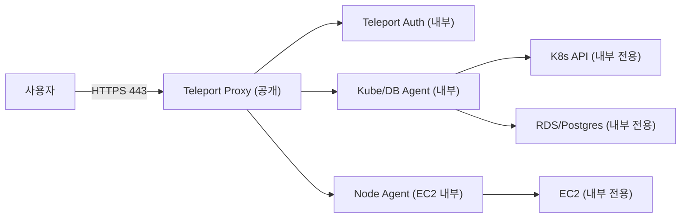

# Teleport Test (EKS + RDS + OpenTofu)

Teleport는 SSH/Kubernetes/Database/Application 접근을 **하나의 게이트**로 통합해 관리하는 Zero Trust 접근 플랫폼입니다. 정적 키/패스워드를 공유하는 방식 대신 **단기 인증서와 정책 기반 접근**을 사용하고, **세션 감사/기록**을 기본값으로 제공합니다.

핵심 특징은 아래 네 가지로 요약됩니다.

- SSH/K8s/DB 접근을 **하나의 정책/감사 흐름**으로 통합
- **단기 인증서 발급**으로 권한 범위를 최소화
- 승인(Access Request), MFA 강제, 세션 레코딩 등 **컴플라이언스 기능 내장**
- 리소스 접근 경로를 Proxy로 집중시키는 **게이트웨이 구조**

이 문서는 Teleport의 통합 접근 제어 흐름을 체험하기 위해 EKS와 RDS를 구성하고, Teleport Cluster + Kube/DB Agent를 배포하는 실습 환경을 제공합니다.

## 접근/네트워크 흐름 요약

Teleport는 “리소스마다 포트를 열어두는 방식” 대신 **게이트(Proxy) 하나만 외부에 노출**하고, 내부 리소스는 **직접 노출하지 않는 구조**를 지향합니다. 에이전트가 내부에서 바깥으로 터널을 열어 붙는 방식이라, 리소스 측 인바운드 포트를 최소화할 수 있습니다.



## 접근제어 도구 분류와 비교

접근제어는 보통 **아이덴티티(SSO)**, **접근 경로/게이트**, **PAM(계정/비밀관리)**로 나뉩니다. Teleport는 “접근 경로/게이트” 축에 있고, SSO 도구와 연동해 쓰는 구조가 일반적입니다.

| 범주 | 대표 도구 | 강점 | 한계/주의 |
| --- | --- | --- | --- |
| IdP/SSO | Keycloak, Cognito, Entra ID, Okta, Auth0 | 로그인/토큰 발급, 사용자 라이프사이클/SSO | 리소스 접근 프록시/세션 감사는 별도 구성 필요 |
| 접근 게이트/프록시 | Teleport, Boundary, StrongDM, Cloudflare Access, Zscaler ZPA | 접근 경로 집중, 세션 기반 통제/감사, MFA/승인 연계 | IdP 연동 필요, 네트워크/정책 설계 필요 |
| PAM | CyberArk, BeyondTrust, Delinea | 계정/비밀번호 금고, 승인/감사, 규정 준수 | 도입/운영 복잡, 프로세스 영향 큼 |

정리하면:
- **SSO 자체가 목적**이면 IdP/SSO가 중심입니다.
- **SSH/K8s/DB 접근을 한 정책/감사 흐름으로 묶고 싶다면** 접근 게이트/프록시 계열이 중심입니다.
- 실무에서는 **IdP(예: Keycloak/Cognito) + Teleport 연동** 조합이 많이 쓰입니다.

## 디렉터리 구성

```
teleport-test/
├── README.md
├── terraform/
│   ├── main.tf
│   ├── provider.tf
│   ├── locals.tf
│   ├── variables.tf
│   ├── vpc.tf
│   ├── eks_cluster_iam.tf
│   ├── eks_cluster.tf
│   ├── eks_access.tf
│   ├── rds.tf
│   ├── ec2_node.tf
│   ├── outputs.tf
│   ├── manifest/
│   │   ├── teleport-cluster-values.yaml
│   │   └── teleport-kube-agent-values.yaml
│   └── tfstate/
```

## 전제 조건

- AWS CLI v2, OpenTofu, kubectl, helm 설치
- AWS 프로파일 준비(기본값: `private`)
- EKS API 접근 CIDR은 기본적으로 **현재 공인 IP를 자동 감지**해 `/32`로 설정됨
- SSO 연동 없음(로컬 인증 기반)

## 실행 순서

### 1) 인프라 생성 (VPC/EKS/RDS)

```bash
cd terraform

tofu init
tofu apply
```

출력값 확인:

```bash
tofu output
```

### 2) kubeconfig 설정

```bash
aws eks update-kubeconfig --name <cluster_name>
```

`tofu output kubeconfig_command`를 그대로 사용해도 됩니다.

### 3) Teleport Cluster 설치

```bash
helm repo add teleport https://charts.releases.teleport.dev
helm repo update

helm install teleport-cluster teleport/teleport-cluster \
  -f ./manifest/teleport-cluster-values.yaml
```

- `clusterName`: Teleport 접속용 FQDN
- `kubeClusterName`: EKS 식별용 이름(임의 지정 가능)

### 4) Kube/DB 실행 방식 (Kubernetes 에이전트)

Kubernetes/DB 접근은 `teleport-kube-agent` Helm 차트로 실행합니다.

1) 조인 토큰 생성 (kube, db)
```bash
kubectl -n default exec -it deploy/teleport-cluster-auth -- tctl tokens add --type=kube,db
```

2) 값 수정
- `proxyAddr`: Teleport Proxy 주소 (예: `teleport.example.com:443`)
- `databases[].uri`: `tofu output rds_endpoint` 결과 + 포트

3) 에이전트 설치
```bash
helm install teleport-agent teleport/teleport-kube-agent \
  -f ./manifest/teleport-kube-agent-values.yaml
```

### 5) Node 실행 방식 (EC2 에이전트)

EC2 접근은 인스턴스에 Teleport 노드 서비스를 설치해 조인합니다.

1) EC2 인스턴스 생성
```bash
cd terraform

tofu apply -var 'ec2_enabled=true'
tofu output ec2_instance_id
tofu output ec2_ssm_start_session
```

2) 조인 토큰 생성 (node)
```bash
kubectl -n default exec -it deploy/teleport-cluster-auth -- tctl tokens add --type=node --ttl=1h
```

3) 노드 설치/조인 (예시, Amazon Linux 2023)
```bash
aws ssm start-session --target <instance-id> --region ap-northeast-2 --profile private

curl -O https://cdn.teleport.dev/teleport-v18.6.4-linux-amd64-bin.tar.gz
tar -xzf teleport-v18.6.4-linux-amd64-bin.tar.gz
sudo ./teleport/install

sudo teleport start --roles=node --token=<token> --proxy=teleport.example.com:443 --nodename=teleport-ec2
```

### 6) 리소스별 접근 테스트

```bash
# Teleport 로그인
tsh login --proxy=teleport.example.com --user=<user>

# Kubernetes 접근 확인
tsh kube ls
tsh kube login <kubeClusterName>
kubectl get nodes

# Database 접근 확인
tsh db ls
tsh db connect teleport-rds

# EC2 접근 확인 (node 사용 시)
tsh ls
tsh ssh ec2-user@teleport-ec2
```

## 참고

- `admin_cidrs`를 수동으로 지정하려면 `-var 'admin_cidrs=["x.x.x.x/32"]'` 형태로 실행합니다.
- RDS는 프라이빗 서브넷에 생성되므로 외부 직접 접속은 불가합니다. Teleport 경유 접근을 전제로 합니다.
- DNS를 사용하지 않는 테스트라면 `tsh login --insecure` 옵션을 고려하세요.

## 정리

```bash
cd terraform

tofu destroy
```
