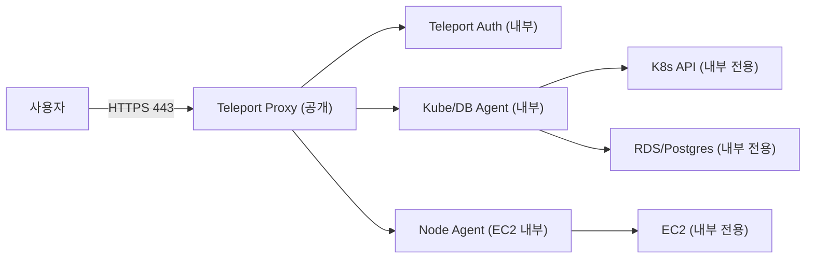

# Teleport Test (EKS + RDS + OpenTofu)

Teleport는 SSH/Kubernetes/Database/Application 접근을 **하나의 게이트**로 통합해 관리하는 Zero Trust 접근 플랫폼입니다. 정적 키/패스워드를 공유하는 방식 대신 **단기 인증서와 정책 기반 접근**을 사용하고, **세션 감사/기록**을 기본값으로 제공합니다.

핵심 특징은 아래 네 가지로 요약됩니다.

- SSH/K8s/DB 접근을 **하나의 정책/감사 흐름**으로 통합
- **단기 인증서 발급**으로 권한 범위를 최소화
- 승인(Access Request), MFA 강제, 세션 레코딩 등 **컴플라이언스 기능 내장**
- 리소스 접근 경로를 Proxy로 집중시키는 **게이트웨이 구조**

이 문서는 Teleport의 통합 접근 제어 흐름을 체험하기 위해 EKS와 RDS를 구성하고, Teleport Cluster + Kube/DB Agent를 배포하는 실습 환경을 제공합니다.

## 접근/네트워크 흐름 요약

Teleport는 “리소스마다 포트를 열어두는 방식” 대신 **게이트(Proxy) 하나만 외부에 노출**하고, 내부 리소스는 **직접 노출하지 않는 구조**를 지향합니다. 에이전트가 내부에서 바깥으로 터널을 열어 붙는 방식이라, 리소스 측 인바운드 포트를 최소화할 수 있습니다.



## 접근제어 도구 분류와 비교

접근제어는 보통 **아이덴티티(SSO)**, **접근 경로/게이트**, **PAM(계정/비밀관리)**로 나뉩니다. Teleport는 “접근 경로/게이트” 축에 있고, SSO 도구와 연동해 쓰는 구조가 일반적입니다.

| 범주 | 대표 도구 | 강점 | 한계/주의 |
| --- | --- | --- | --- |
| IdP/SSO | Keycloak, Cognito, Entra ID, Okta, Auth0 | 로그인/토큰 발급, 사용자 라이프사이클/SSO | 리소스 접근 프록시/세션 감사는 별도 구성 필요 |
| 접근 게이트/프록시 | Teleport, Boundary, StrongDM, Cloudflare Access, Zscaler ZPA | 접근 경로 집중, 세션 기반 통제/감사, MFA/승인 연계 | IdP 연동 필요, 네트워크/정책 설계 필요 |
| PAM | CyberArk, BeyondTrust, Delinea | 계정/비밀번호 금고, 승인/감사, 규정 준수 | 도입/운영 복잡, 프로세스 영향 큼 |

정리하면:
- **SSO 자체가 목적**이면 IdP/SSO가 중심입니다.
- **SSH/K8s/DB 접근을 한 정책/감사 흐름으로 묶고 싶다면** 접근 게이트/프록시 계열이 중심입니다.
- 실무에서는 **IdP(예: Keycloak/Cognito) + Teleport 연동** 조합이 많이 쓰입니다.

## 디렉터리 구성

```
teleport-test/
├── README.md
├── terraform/
│   ├── main.tf
│   ├── provider.tf
│   ├── data_sources.tf
│   ├── locals.tf
│   ├── variables.tf
│   ├── vpc.tf
│   ├── network_core.tf
│   ├── network_teleport.tf
│   ├── network_ssm_endpoints.tf
│   ├── bastion.tf
│   ├── eks_addon_irsa.tf
│   ├── eks_addon.tf
│   ├── eks_cluster_iam.tf
│   ├── eks_cluster.tf
│   ├── eks_access.tf
│   ├── rds.tf
│   ├── ec2_node.tf
│   ├── outputs.tf
│   ├── manifest/
│   │   ├── teleport-cluster-values.yaml
│   │   ├── teleport-kube-agent-values.yaml
│   │   └── ssm_user_data.sh.tftpl
│   └── tfstate/
```

## 전제 조건

로컬(작업 PC/WSL):
- AWS CLI v2 + Session Manager Plugin
- OpenTofu
- AWS 프로파일 준비(기본값: `private`)
- 기본값: EKS `1.33`, 노드 AMI `AL2023_x86_64_STANDARD`

베스천(user_data 자동화):
- awscli, kubectl, helm, git, k9s, tsh 설치
- `~/kubernetes`에 레포 자동 클론
- `~/.kube/config` 자동 생성
- Teleport 클러스터/에이전트 `helm upgrade --install`
- `REPLACE_WITH_JOIN_TOKEN`이 있으면 토큰 생성 후 자동 주입
- user_data 템플릿: `terraform/manifest/ssm_user_data.sh.tftpl`

## 실행 순서

1) (로컬) values 준비
- `terraform/manifest/teleport-cluster-values.yaml`: `clusterName`, `kubeClusterName`
  - `clusterName`: Teleport 웹/프록시 접속에 쓰이는 **클러스터의 외부 주소(FQDN)**. 예: `teleport.example.com`
  - `kubeClusterName`: Teleport UI/`tsh`에서 표시되는 **Kubernetes 클러스터 식별 이름**. 예: `eks-teleport-test`
- `terraform/manifest/teleport-kube-agent-values.yaml`: `proxyAddr`, `databases[].uri`
  - `proxyAddr`: Teleport Proxy 주소 **호스트:포트** 형식. 예: `teleport.example.com:443`
- `joinParams.tokenName`은 `REPLACE_WITH_JOIN_TOKEN` 상태로 둡니다.
- `databases[].uri`는 `REPLACE_WITH_RDS_ENDPOINT`로 둬도 됩니다. user_data가 RDS 엔드포인트를 자동 주입합니다.

2) (로컬) 인프라 프로비저닝
```bash
cd terraform

tofu init
tofu apply
```

3) (로컬) 베스천 접속
```bash
cd terraform

tofu output -raw bastion_ssm_start_session
```

user_data 동작을 바꾸려면 `terraform/manifest/ssm_user_data.sh.tftpl`을 수정하고 베스천을 재생성합니다.

## 기능 확인 (베스천)

Teleport 사용 관점에서 동작 여부를 확인합니다.

1) Proxy 주소 확인
```bash
PROXY="$(kubectl -n default get svc teleport-cluster -o jsonpath='{.status.loadBalancer.ingress[0].hostname}')"
echo "${PROXY}"
```

2) Teleport 로그인 (로컬 인증 기준)
```bash
tsh login --proxy=${PROXY}:443 --user=<user> --insecure
```

로컬 사용자 생성이 필요하면 아래를 먼저 실행합니다.
```bash
kubectl -n default exec -it deploy/teleport-cluster-auth -- tctl users add <user> --roles=access,editor
```
출력된 초대 링크로 접속해 비밀번호/MFA를 설정한 뒤 로그인합니다.

3) Kube/DB 리소스 조회
```bash
tsh kube ls
tsh db ls
```

4) Kubernetes 접속 확인
```bash
tsh kube login <kubeClusterName>
kubectl get nodes
```

5) DB 접속 확인
```bash
tsh db connect teleport-rds
```

## 참고

- EKS API가 프라이빗이면 `kubectl`/`tsh`는 VPC 내부(베스천/SSM/VPN)에서만 가능합니다.
- EKS Access Entry는 IAM Role/User ARN 형식을 요구합니다. 기본값은 현재 호출자 ARN을 자동 정규화합니다.
- RDS는 프라이빗 서브넷에 생성되므로 외부 직접 접속은 불가합니다.
- DNS를 사용하지 않는 테스트라면 `tsh login --insecure` 옵션을 고려하세요.

## 정리

```bash
cd terraform

tofu destroy
```
